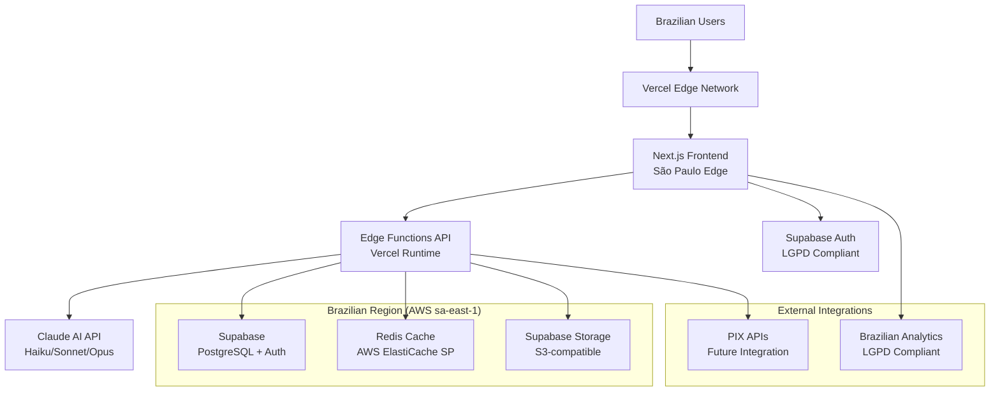

# High Level Architecture

## Technical Summary

RachaAI employs a modern **Jamstack architecture** with serverless backend functions, combining Next.js frontend with Supabase services and intelligent Claude AI integration. The system uses **Vercel Edge Functions** for API endpoints with Brazilian region optimization, **Supabase PostgreSQL** for structured data persistence, and **Redis** for high-performance conversation caching. The architecture prioritizes **conversation-first UX** with real-time chat interfaces, **cost-optimized Claude AI routing** (70% Haiku, 25% Sonnet, 5% Opus), and **LGPD-compliant data residency** in Brazilian AWS regions. This design achieves the PRD's target of <1.5s response times while supporting 200+ concurrent users through intelligent caching and edge deployment.

## Platform and Infrastructure Choice

**Platform**: Vercel + Supabase + AWS (Brazilian Regions)

**Key Services**:
- **Frontend Hosting**: Vercel Edge Network with São Paulo edge optimization
- **Backend Functions**: Vercel Edge Functions for API routes
- **Database**: Supabase PostgreSQL (AWS sa-east-1 São Paulo)
- **Cache**: Redis (AWS ElastiCache sa-east-1 for LGPD compliance)
- **AI Processing**: Claude API via Anthropic with cost optimization routing
- **File Storage**: Supabase Storage (S3-compatible, Brazilian regions)
- **Authentication**: Supabase Auth with custom LGPD consent flows

**Deployment Host and Regions**: Primary deployment in Brazilian regions (AWS sa-east-1) with Vercel global edge for frontend optimization

**Rationale**: This combination provides optimal Brazilian performance, LGPD compliance through data residency, rapid development velocity, and cost-effective scaling for AI-heavy workloads.

## Repository Structure

**Structure**: Monorepo with Turborepo
**Monorepo Tool**: Turborepo for build optimization and caching
**Package Organization**: Apps (web frontend, API edge functions) + Packages (shared types, UI components, utilities)

## High Level Architecture Diagram

## Architectural Patterns

- **Jamstack Architecture**: Static site generation with serverless APIs - _Rationale:_ Optimal performance and cost efficiency for conversational applications with edge deployment
- **Component-Based UI**: Reusable React components with TypeScript - _Rationale:_ Maintainability and type safety across conversational interface components
- **Service Layer Pattern**: Abstracted business logic from API routes - _Rationale:_ Enables testing and maintains separation between Claude AI integration and application logic
- **Repository Pattern**: Abstract data access for Supabase interactions - _Rationale:_ Enables testing and potential future database changes while maintaining LGPD compliance
- **Conversation State Management**: Immutable state with optimistic updates - _Rationale:_ Ensures responsive chat UX while maintaining data consistency
- **Intelligent Caching**: Multi-layer caching with Redis and Vercel edge - _Rationale:_ Achieves <1.5s response time targets while optimizing Claude AI costs
- **Cost-Aware AI Routing**: Dynamic model selection based on complexity - _Rationale:_ Balances response quality with cost optimization (70/25/5 distribution) 